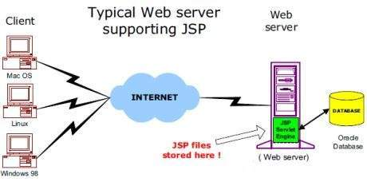

# Servlets e JSP

## JSP - Architecture

 

### JSP：
|  Conteúdo   |    Syntax  - Directives - Actions  - Implicit Objects  - Client Request - Server Response - Http Status Codes - Form Processing - Writing Filters - Cookies Handling - Session Tracking - File Uploading - Handling Date - Page Redirect - Hits Counter - Auto Refresh - Sending Email                                                                                                                                      |
| :-------:   | --------------------------------------------------------------------------------------------------------------------------------------------------------------------------- |

## Conecte-se comigo

## GitHub Stats

## GitHub Streak

